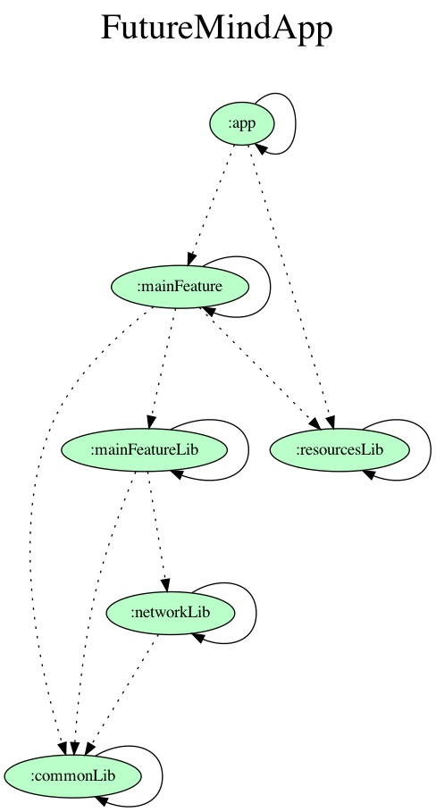

# FutureMindApp

Project created for the recruitment process in Future Mind company.

Tech stack:
- Kotlin
- Hilt
- Coroutines
- Stateflow
- Navigation Component
- Viewmodel
- Room
- Retrofit

MVVM/MVI architecture with focus on unidirectional data flow.
No tests for now. (16.04.2021)

App is multimodule, constructed with the following assumptions:
- common library modules - networkLib, resourcesLib, commonLib
- feature library modules, should depend on common modules only
- feature modules with clean architecture encapsulated,
should depend only on feature library module characteristic for given feature, and common modules
- app module should depend on feature modules and can depend on common modules

